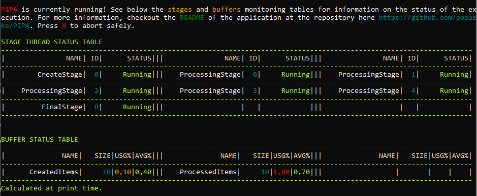
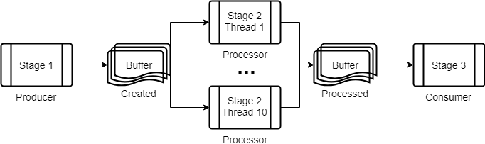

# PIPA

The **P**ipelined **I**nput **P**rocessing **A**pplication is a C# application that allows the creation of complex flows of data for transformation and exportation of any volume of data objects, in a simple and centralized way.

The program uses the [.NET Pipeline](https://msdn.microsoft.com/en-us/library/ff963548.aspx) as its basic structure, giving the user full control of how the data will be processed, by allowing the complete configuration of the data buffers and the stages of the pipeline. Each *Stage* is a single ```.cs``` file, and implements a single data processing funcion, be it data generation (database reads, etc), data processing (content validation, etc) or data exports (writing to files, etc), that can be run in a single or multiple threads, with no added complexity.

The modularity makes it easy to change the code and add new features, and also allows extreme customization of the flow of data, be it for exporting files, ETL workflows or any other kind of data manipulation. The main concerns related to the use of this application are related to the increased complexity in managing configurations (which will be covered in this file) and the fact that this is a centralized application.

See at the section below how to use the application by reading the documentation and the provided example. Furthermore, at the modules (stage types) section, read about how to use the implemented modules and how to add new modules. 

## Configuration Parameters

The program requires a single **configfile** ```command line parameter``` (optionally defined at the ```app.config``` file) for the path for the ```JSON``` file, which contains the actual program parameters.

```
<add key="configFile" value="path\to\config.json" />
```

At the ```JSON``` file, two list attributes, **BufferList** and **StageList** , as seen below:

```
{
    "BufferList": [...],
    "StageList": [...],
    /* Misc Parameters*/
}
```

Each one defines part of the actual structure of the pipeline.

### BufferList

This list contains ```StageBuffer``` objects, which are the buffers between two consecutive stages. It has only two attributes:

* **BufferName**: An unique identification for the buffer
* **BuffferSize**: The number of data objects that that buffer can hold

### StageList

This list contains ```StageConfiguration``` objects, each defining a step of the pipeline. Its attributes are:

* **StageName**: The name of the stage, which is optional, but recommended.
* **StageType**: The actual processing function that is implemented by the stage. It correlates exactly to one of the available modules of the pipeline and to a single ```.cs``` file and class, at the ```Stage``` directory in the project root.
* **InputBufferName**: The name of the buffer that will be used as the input for this stage. Must be exactly one of the ```BufferName``` attributes defined at one of the buffer object at the ```BufferList```. Can be null if this is starting a new pipeline data stream.
* **OutputBufferNames**: list of ```BufferName```s (same case as the InputBufferName) to which the results of this stage will be sent. Can be null, if this is the final stage. Each specified buffer will receive a copy of *all* the data objects processed by this stage.
* **StageThreadsNumber**: Integer representing the number of threads to be executed for this stage. Each thread performs the exact same processing, to the same input and output buffers. Some of the stages won't allow for more than one thread and will ignore this attribute. If none is defined, defaults to ```1```. *Note* that **all threads** run from the same ```Stage``` object, sharing it's memory pool. Therefore, if using shared objects while adding new modules (which may be *very* useful), consider using thread safe ones.
* **StageParameters**: A dynamic object, which attributes and properties are defined by the ```StageType```. See the available modules (types) for specific information on each case.



*Real time monitoring of stage and buffer status*

### Misc Parameters

Optional control parameters.

* **EnableMonitoring**: Boolean, enables or disables the tables seen in the picture above. Defaults to ```true```.
* **MonitoringDelay**: Integer, miliseconds between the execution of the stages and buffers monitoring, time in wich the program will be waiting for the finalization of all threads. Defaults to ```10000```.
* **MonitoringSkip**: Integer, makes tables be printed after a ```MonitoringDelay``` *once every ```MonitoringSkip``` times*. Defaults to ```1```. Increase this number if you whish to mantain the monitoring in a log intensive pipeline, of if your process should be running for a long time.
* **AutoCancellationTimeout**: Defaults to ```-1```(milliseconds). If this value is greater than ```0```, the main thread will execute a check of all the buffers every ```AutoCancellationTimeout``` milliseconds. If all buffers are empty a cancellation request will be issued and the pipeline will stop. Negative values will make the process ignore this check. Useful if you don't have a clear stop condition.

### Aliases

Aliases allow you to avoid repeating yourself while creating configuration files. Instead of repeating the same address for all the modules that access the same database or API, define one alias for said resource and reference only the alias. Any line **starting** with the special character string ```#alias``` will be treated as an alias. The alias syntax is as follows:

```
#alias <alias-name> <alias-value>
```

Aliases can be used to insert *any type of value* in the configuration file *as a string* just before the moment the configuration file is parsed and deserialized by the JSON parser, so, as long the resulting JSON is valid, your alias will take effect. Note that any lines starting with an ```#alias``` will be ignored by the JSON parser. The following example displays a real use case for the alias feature.

### Example

Here is a simple use case, which makes it clear how the configuration works.




The example workflow above is represented and achieved by the following configuration (at ```PIPA/Sample/example_config.json```): 

```
#alias !Buffer1Name "CreatedItems"
#alias !Buffer1Size 10
{
  "BufferList": [
    {
      "BufferName": !Buffer1Name,
      "BufferSize": !Buffer1Size
    },
    {
      "BufferName": "ProcessedItems",
      "BufferSize": 10
    }
  ],
  "StageList": [
    {
      "StageName": "CreateStage",
      "StageType": "Test.Producer",
      "OutputBufferNames": [ !Buffer1Name ],
      "StageParameters": {
        "MsProductionDelay":  10
      }
    },
    {
      "StageName": "ProcessingStage",
      "StageType": "Test.Processor",
      "InputBufferName": !Buffer1Name,
      "OutputBufferNames": [ "ProcessedItems" ],
      "StageThreadsNumber": 10,
      "StageParameters": {
        "MsProcessingDelay": 100
      }
    },
    {
      "StageName": "FinalStage",
      "StageType": "Test.Consumer",
      "InputBufferName": "ProcessedItems",
      "StageParameters": {
        "MsConsumingDelay": 10,
        "Limit": 100
      }
    }
  ]
}

```

We are defining two buffers, each of size 10. Those buffers are then used to connect the 3 stages. The first, ```CreateStage``` only adds data to the first buffer. The second, ```ProcessingStage```, consumes the data from the first stage and then adds the processed records to the second buffer. The third stage,  ```FinalStage```, finally consumes the data from the last buffer.

Note that the milisecond delays are custom parameters for each of the stage types (in this case, ```Test.Producer```, ```Test.Processor``` and ```Test.Consumer```, all defined here: PIPA/Stage/Example. Also note that the delay of the Processor is ten times larger than those of the Producer and the Consumer. To compensate, we are launching 10 threads for the second stage, by simply adding ```"StageThreadsNumber": 10```.

## Modules

### IStage Interface

```
    public interface IStage
    {
        bool RequireCancellationToken { get; }
        bool AllowMultiThreading { get; }
        bool Initialize(dynamic parameters);
        void Run(IEnumerable<dynamic> input, 
                 List<BlockingCollection<dynamic>> output, 
                 CancellationManager token, 
                 Logger logger);
    }
```

Each stage, or module, is required to implement the ```IStage``` interface. This makes it easy for new users to implement their own modules, as no other piece of code needs to be changed. If there are any questions related to how to add new modules, you can take a look at the example above, with its very simple implemented modules (see PIPA/Stage/Example). The interface contains two methods and two properties:

* **RequireCancellationToken**: A property which defines if the stage needs to be finalized by itself before the finalization of the pipeline. By having this property take the value ```true```, the application will wait the stage issue a Stop request before finalizing. If multiple stages have this property *enabled*, then all of them must be finnished before ending the execution.

* **AllowMultiThreading**: A property which defines if the stage can be run with multiple threads. A stage which can be run independtly for each of its data objects, and could be run with multiple threads, should have this returning true. An example of a stage that should be set like this: ```bool IStage.AllowMultiThreading { get { return false; } }```, for example, is a final stage, where data is beeing exported to a file.

* **Initialize(dynamic parameters)**: this method simply initializes any of the stage properties, and will be used even if there is nothing to be initialized.

* **Run(BlockingCollection\<dynamic\> input, List\<BlockingCollection\<dynamic\>\> output, CancellationTokenSource token, NLog.Logger logger)**: this method is the core of the stage. Here all the processing is implemented and executed. It receives as parameters the read and write buffers, any of which can be null, and the NLog logger object. It also receives the CancelationManager token, which is used to abort the execution of all stages when the goal of the processing is reached. To activate the cancelation token, use its ```RequestStop()``` method (you can see the ```Stage\Test\Consumer.cs``` stage for an example).

### Adding New Modules

All you need to do is to add a new ```.cs``` file containing a class implementing the ```IStage``` interface, at the ```Stage``` directory. Some **tips and suggestions** are listed below:

#### IStage.Run() Strucutre

Use the following structure for the IStage.Run method:
```
// Declaration of variables and misc initializations
try
{
    // Actual code
}
catch (OperationCanceledException) { }
finally
{
    // Thread finalization
}
```

#### Sending data to the next stages

Bad use of a BlockedCollection may cause deadlocks. For example: if many threads are saving data in a collection and a cancellation order is issued, there is a possibility that the collection will be blocked before the data in one of the threads is dispatched, causing the thread to be blocked with the data.

To avoid blocked threads after the finalization of the pipeline, use the ```PIPA.Utils.PipelineUtils.SendResult(...)``` method, which takes care of avoing such problems. 

